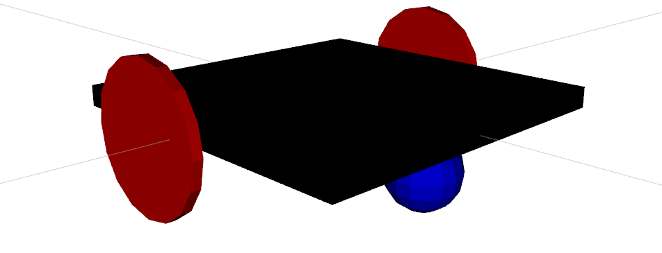
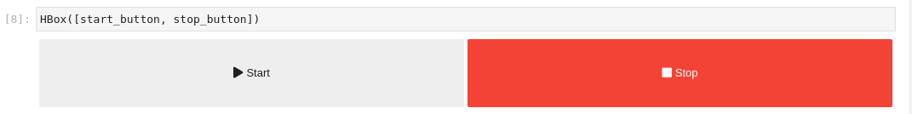
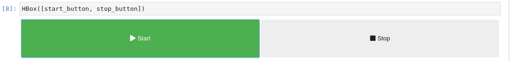
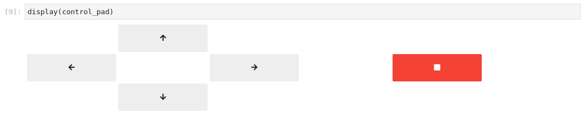
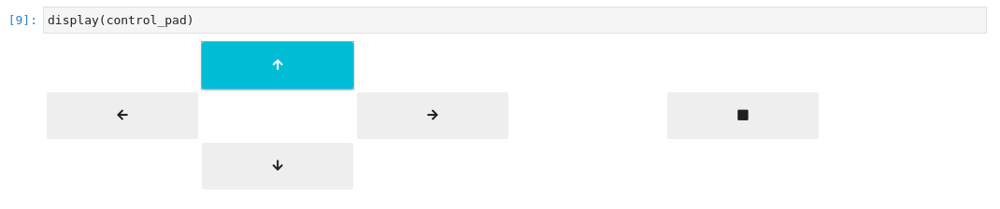
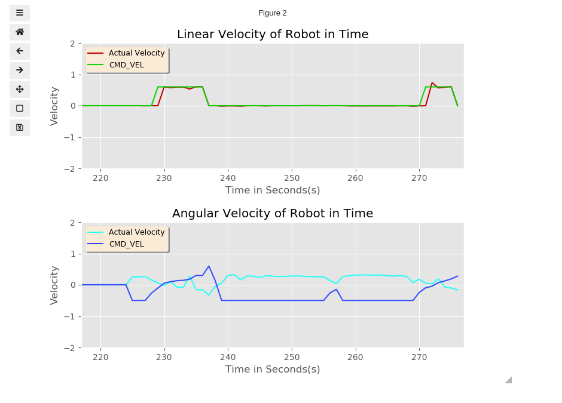
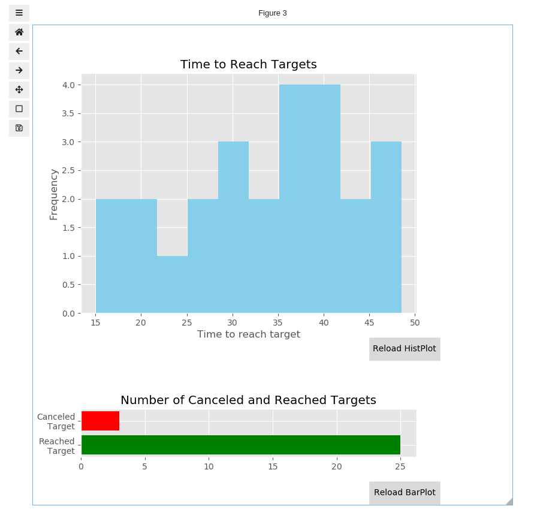

# Second Assignment of the Research Track 2 course (Robotics Engineering / JEMARO, Unige)

**Author's Name: Omotoye Shamsudeen Adekoya**

**Student ID: 5066348**

---
<div align="center">
<h1> Robot Controller </h1>

</div>
This package is an update to the package contained in [First Assignment of the Reasearch Track 2 course](). To read the assignment specification [Click here](docs/assignment2.pdf). 

# ROS Package Description
This package contains a **Jupyter Notebook** which serves as a User Interface for the control and analysis of the two wheeled robot in a gazebo 3D simulation. In the previous release of this package, the user interface was a command line interface in which character command was required by the state machine to send a required command to the robot. What this package provides is a Graphical Interface by the way of a Jupyter Notebook for sending a start, stop command to the robot, controling the robot with a direction controller and displaying feedback analysis data through plots in the Notebook

## Previous Package 
A quick brief about the previous package; the package implements a state machine, a random position service, and a go to point action server.A Numeric command is gotten from the User Interface and based on the value sent from the user interface, the robot either starts to reach a goal coordinate or stop going to a goal coordinate. The random position server is in charge of generating the random target coordinate and the state machine transitions the state of the system based on the input gotten from the user. 

## Notebook Description
The Jupyter Notebook is contained of a number of plots and buttons for the control and the display of the analysis data of the state of the robot, they are all listed below for further description. 
* Start/Stop Button 
* Control Pad 
* Position Plot 
* Velocity Plot 
* Bar and Hist Plot 

### Start/Stop Button 
This is the button used for starting and stopping the robot. These buttons acts as a client service sending a request of either start or stop to the state machine through the **/user_interface** service. To make the button more intuitive a change of color is implement based on any state the robot is at (ie started or stopped). An image showing what the button looks like is attached below. 


<div align="center">




</div>

When the robot has been stopped the start button is grey and the stop button is red.
When the robot has started to reach the target coordinate the start button is green and the stop button is grey.

### Control Pad 
The Control Pad is a controller used for moving the robot around the simulation by direct input from the user. The stop button is red when the robot is stopped and grey when the robot is in motion. if the robot is already in the random position goal mode the control pad is cannot control the robot, so when the random position simulation has started the control pad cannot be started. 
<div align="center">


</div>

### Position Plot
The position plot is an x, y plot that is used to visualize the position of the robot, orientation of the robot, the goal position, and the path the robot has moved through. It is a live plot that shows the real-time state of the robot. This plot also features an axes for diplaying the textual value of these robot state data like the distance between the robot and the target, the pose and orientation of the robot and the target coordinate of the goal pose. A slider is also included below the plot to scale the robot linear/angular velocity down or up by a factor of a maximum of **X2**. While the robot path is being plotted the path plotted on the screen can get very messy and unreadable, for this reason a button for clearing the path has been added to the plot.
<div align="center">

</div>

### Velocity Plot 
The velocity plot is a live plot that is used to visualize the **cmd_vel velocity** (velocity command sent to the robot) against the **actual velocity** the robot is moving at. It shows the variation for both linear and angular velocity
<div align="center">

</div>

### Bar and Hist Plot 
The figure below contains a bar plot and a hist plot. The bar plot is for showing the number of target goal that was reached an the number of the goal that was canceled. The Hist plot is for showing the frequency of the time it take the robot to reach the target (the time is only measure for goals that was SUCCEEDED). This is however not a live plot, a button has been provided for each of the plot for reloading the plot with the most recent data available. 
<div align="center">

</div>

The data that is being plotted on the bar plot and the hist plot is gotten through a function call in the go to point node.

```python
def ui_param_data(value, state):
    """This function is used for processing the value of the data
    sent to the Notebook UI based on the state argument provided to it

    Args:
        value ([int]): This is the value to be sent to the Notebook Ui,
        based on the state provided. 
        state ([int]): this determines the type of data that's in the 
        value argument. 
    """
    global canceled_target, reached_target, goal_time_list, target_point
    if (state == 0):
        canceled_target += 1
        rospy.set_param('/canceled_target', canceled_target)
    if (state == 1):
        reached_target += 1
        rospy.set_param('/reached_target', reached_target)
    if (state == 2):
        goal_time_list.append(value) 
        rospy.set_param('/target_time', goal_time_list)
    if (state == 3):
        target_point.append(value)
        if (len(target_point) == 3):
            rospy.set_param('/target_point', target_point)
            target_point = []
```
The function implements a parameter server for saving the data, the data is then retrieved when the user clicks on the reload plot button on each of the plot. 


